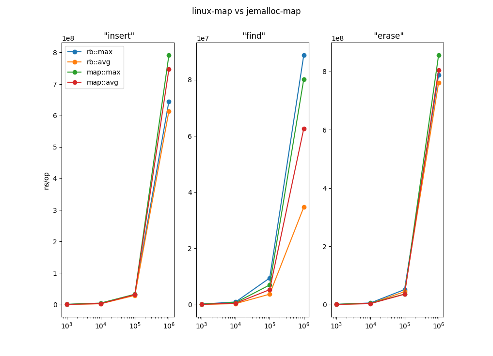

# rbtree_bench



## About this project

This project aims to enhance the performance of [rv32emu](https://github.com/sysprog21/rv32emu) by addressing issue [#29](https://github.com/sysprog21/rv32emu/issues/29).

Originally, rv32emu uses a Linux-like red-black tree implementation that provides an interface similar to C++ std::map. In this project, we have modified the red-black tree implementation from jemalloc to improve the performance of map insertion, find, and delete operations.

The following data represents the average time of 20 experiments, each involving the insertion, finding, and deletion of 1 million randomly generated nodes in a random order tested on Apple M1 Pro (10 core)

| Type        | Insert (ns) | Find (ns) | Remove (ns) |
| ----------- | ----------: | --------: | ----------: |
| map         |   746263750 |  62612250 |   804232500 |
| rb          |   613500500 |  34647200 |   760888100 |
| improvement |        17 % |      44 % |       5.5 % |

For the insert operation, the map implementation took an average of 746,263,750 nanoseconds, while the rb tree implementation showed improved performance with an average of 613,500,500 nanoseconds. This represents a 17% improvement in insertion time compared to the map implementation.

In terms of the find operation, the map implementation had an average time of 62,612,250 nanoseconds, whereas the rb tree implementation demonstrated superior efficiency with an average of 34,647,200 nanoseconds. This indicates a notable improvement of 44% in finding elements within the rb tree compared to the map implementation.

For the remove operation, the map implementation required an average of 804,232,500 nanoseconds, while the rb tree implementation showcased enhanced performance with an average of 760,888,100 nanoseconds. This signifies a modest 5.5% improvement in removal time compared to the map implementation.

These benchmark results highlight the advantages of using the rb tree implementation over the traditional map implementation, as it consistently outperforms the map implementation in terms of insertion, finding, and removal operations, offering significant performance improvements.

## Getting Started

### Prerequisite

C/Cpp

* CMake
* Make

Python

* matplot
* pandas

### Installation

Clone to your local directory

```shell
git clone https://github.com/ypaskell/rbtree_bench
```

Run cmake

```
cmake .
```

Compile and create executables

```
make
```

## Usage

Run bench

``` shell
./bench.sh
```

## Roadmap

* [x] Clone jemalloc rb.h
* [x] Integrate map interface to match C++ std::map
* [x] Create test for correctness 
* [x] Create bench plot
* [ ] PR
