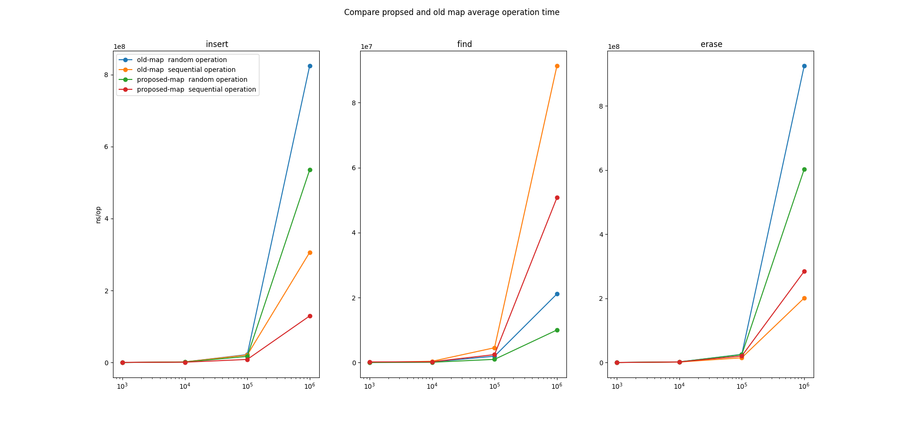

# rbtree_bench



## About this project

This project aims to enhance the performance of [rv32emu](https://github.com/sysprog21/rv32emu) by addressing issue [#29](https://github.com/sysprog21/rv32emu/issues/29).

Originally, rv32emu uses a Linux-like red-black tree implementation that provides an interface similar to C++ std::map. In this project, we have modified the red-black tree implementation from jemalloc to improve the performance of map insertion, find, and delete operations.

The following data represents the average time of 20 experiments, each involving the insertion, finding, and deletion of 1 million randomly generated nodes in a random order tested on Apple M1 Pro (10 core)

Computational time:

| Type        | Insert (ns) | Find (ns) | Remove (ns) |
| ----------- | ----------: | --------: | ----------: |
| original    |   746263750 |  62612250 |   804232500 |
| proposed    |   613500500 |  34647200 |   760888100 |
| improvement |        17 % |      44 % |       5.5 % |

Memory:

| Type     | Stack | Heap |
| -------- | ----: | ---: |
| original |       |      |
| proposed |       |      |

## Getting Started

### Prerequisite

C/Cpp

* CMake
* Make

Python

* matplot
* pandas
* numpy

### Installation

Clone to your local directory

```shell
git clone https://github.com/ypaskell/rbtree_bench
```

Run cmake

```
cmake .
```

Compile and create executables

```
make
```

## Usage

Run bench

``` shell
./bench.sh
```

## Roadmap

* [x] Clone jemalloc rb.h
* [x] Integrate map interface to match C++ std::map
* [x] Create test for correctness 
* [x] Create bench plot
* [ ] PR
